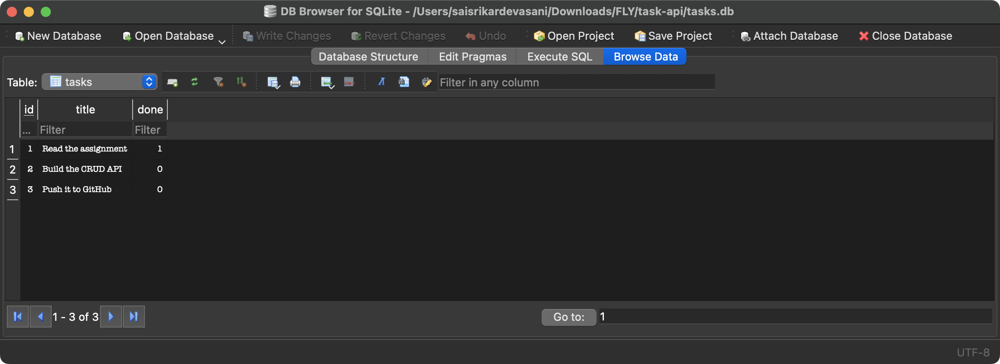
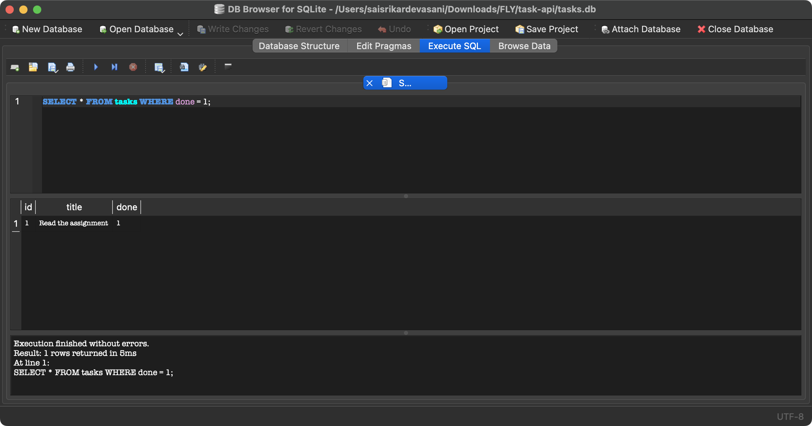
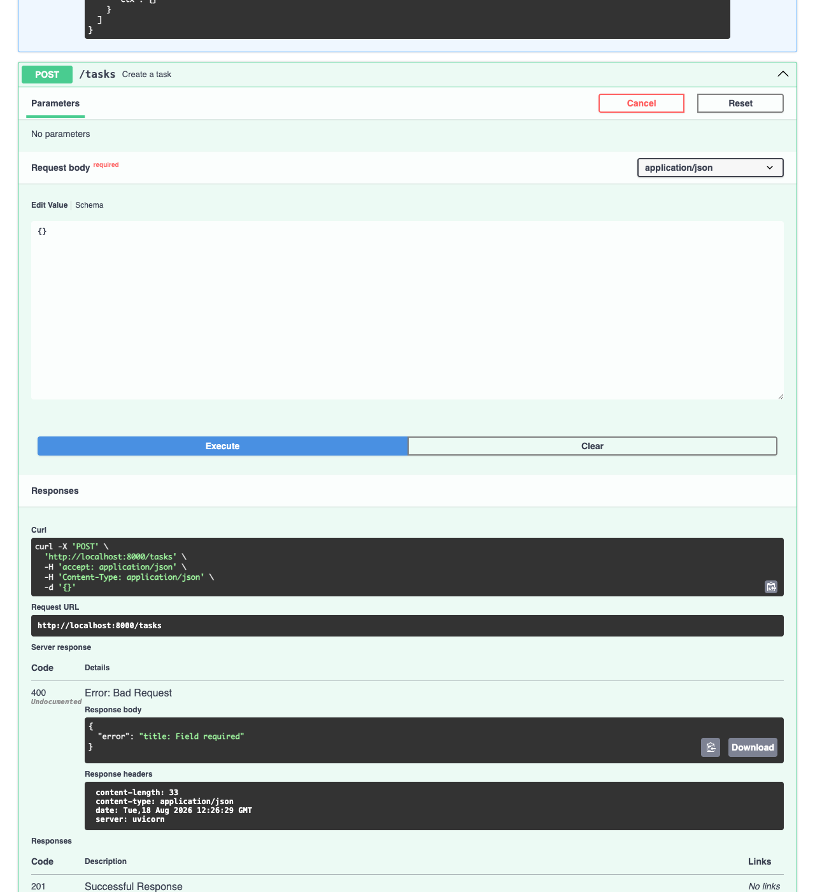

# Task API (FlyRank W2 + W3)

A small to-do API built with FastAPI: create, read, update and delete tasks. Week 2 kept the
tasks in a Python list, so every restart threw them away. Week 3 moved the same five endpoints
onto a SQLite file called `tasks.db`. The requests and the responses did not change; the data
now outlives the process.

FastAPI generates Swagger UI from the code, so the interactive docs sit at
http://localhost:8000/docs with nothing extra installed.

## Run it

You need Python 3.10 or newer. From a clean checkout, one command:

```bash
python3 -m venv .venv && .venv/bin/pip install -r requirements.txt && .venv/bin/uvicorn main:app --reload
```

There is no database step. `tasks.db` does not exist in the repo; `db.init()` creates the file,
the `tasks` table, the index and the three example rows when the app is imported. A fresh clone
of this repo took 5.0 seconds from `git clone` to answering `GET /tasks` with the three seeded
tasks.

If `python3 --version` says 3.9 or older, pip will fail on the FastAPI pin with a long list of
versions and no explanation. Point the first step at a newer interpreter and leave the rest of
the command alone: `python3.11 -m venv .venv`.

Open http://localhost:8000/docs and hit **Try it out** on any endpoint.

To run the checks: `.venv/bin/python test_api.py`, which prints `all checks passed`. It calls
`POST /reset` first, so it leaves `tasks.db` holding the three example tasks.

## Why SQLite

- **It is one file.** `tasks.db` sits next to `main.py`. Copying the file copies the data.
- **There is nothing to install or start.** `sqlite3` ships with Python, and SQLite has no
  server process, no port and no user accounts. The Week 2 run command still works unchanged.
- **The data survives a restart**, a crash and a laptop lid closing, which a Python list does
  not.

`tasks.db` is git-ignored (along with the `-wal` and `-shm` files SQLite writes beside it), so
every clone starts from the same three seeded tasks rather than from my test data.

## Proof: the same responses, now from disk

```console
$ curl -i http://localhost:3000/tasks
HTTP/1.1 200 OK
content-type: application/json

[{"id":1,"title":"Read the assignment","done":true,"created_at":"2026-08-18 13:17:40","updated_at":"2026-08-18 13:17:40"},{"id":2,"title":"Build the CRUD API","done":false,"created_at":"2026-08-18 13:17:40","updated_at":"2026-08-18 13:17:40"},{"id":3,"title":"Push it to GitHub","done":false,"created_at":"2026-08-18 13:17:40","updated_at":"2026-08-18 13:17:40"}]

$ curl -i -X POST http://localhost:3000/tasks -H "Content-Type: application/json" -d '{"title":"Buy milk"}'
HTTP/1.1 201 Created
content-type: application/json

{"id":4,"title":"Buy milk","done":false,"created_at":"2026-08-18 13:17:43","updated_at":"2026-08-18 13:17:43"}

$ curl -i -X POST http://localhost:3000/tasks -H "Content-Type: application/json" -d '{}'
HTTP/1.1 400 Bad Request
content-type: application/json

{"error":"title: Field required"}

$ curl -i -X PUT http://localhost:3000/tasks/4 -H "Content-Type: application/json" -d '{"title":"Buy oat milk","done":true}'
HTTP/1.1 200 OK
content-type: application/json

{"id":4,"title":"Buy oat milk","done":true,"created_at":"2026-08-18 13:17:43","updated_at":"2026-08-18 13:17:43"}

$ curl -i -X DELETE http://localhost:3000/tasks/4
HTTP/1.1 204 No Content
content-type: application/json


$ curl -i http://localhost:3000/tasks/999
HTTP/1.1 404 Not Found
content-type: application/json

{"error":"Task 999 not found"}
```

The `date`, `server` and `content-length` headers are trimmed out of every response above to
keep it readable.

### Persistence, the point of the week

```console
$ curl -s -X POST localhost:3000/tasks -H "Content-Type: application/json" -d '{"title":"Survive a restart"}'
{"id":4,"title":"Survive a restart","done":false,"created_at":"2026-08-18 13:17:54","updated_at":"2026-08-18 13:17:54"}

# stop the server (Ctrl-C), start it again, ask for the same task
$ curl -s localhost:3000/tasks/4
{"id":4,"title":"Survive a restart","done":false,"created_at":"2026-08-18 13:17:54","updated_at":"2026-08-18 13:17:54"}
```

Second proof, from outside the API: `docs/db-browser.png` below is `tasks.db` opened in DB
Browser for SQLite, showing the same rows as a spreadsheet.



## Endpoints

| Method | Path | Does | Success | Errors |
|---|---|---|---|---|
| GET | `/` | What this API is | 200 | |
| GET | `/health` | Liveness check, returns `{"status":"ok"}` | 200 | |
| GET | `/tasks` | List tasks. Optional `?done=`, `?search=`, `?sort=`, `?limit=`, `?offset=` | 200 | 400 bad query |
| GET | `/tasks/{id}` | One task | 200 | 404 unknown id |
| POST | `/tasks` | Create from `{"title": "Buy milk"}` | 201 | 400 missing or empty title |
| PUT | `/tasks/{id}` | Replace `title`, optionally `done` | 200 | 400 invalid body, 404 unknown id |
| DELETE | `/tasks/{id}` | Remove it, empty body | 204 | 404 unknown id |
| GET | `/stats` | `{"total":3,"done":1,"open":2}`, counted with `SELECT COUNT(*)` | 200 | |
| POST | `/reset` | Empty the table and seed it again | 200 | |

A task looks like
`{"id":1,"title":"Read the assignment","done":true,"created_at":"2026-08-18 13:17:40","updated_at":"2026-08-18 13:17:40"}`.
Every error comes back in the same shape, `{"error": "..."}`, whatever went wrong. The 404 text
keeps the Week 2 wording (`Task 999 not found` rather than `Task not found`) because the point
of this week was to change the storage and nothing else.

## The table

```sql
CREATE TABLE IF NOT EXISTS tasks (
  id INTEGER PRIMARY KEY,
  title TEXT NOT NULL,
  done INTEGER NOT NULL DEFAULT 0,
  created_at TEXT NOT NULL DEFAULT (datetime('now')),
  updated_at TEXT NOT NULL DEFAULT (datetime('now'))
);
CREATE INDEX IF NOT EXISTS tasks_title ON tasks (title);
```

`id INTEGER PRIMARY KEY` makes SQLite hand out the ids, so a client never sends one. SQLite has
no boolean type, so `done` is stored as 0 or 1 and `db.to_task()` turns it back into `true` or
`false` on the way out.

Every value reaches SQLite as a `?` parameter. A column name cannot be a parameter, so `?sort=`
is typed as `Literal["id", "title"]` and FastAPI rejects anything else before the query is
built:

```console
$ curl -s 'http://localhost:3000/tasks?sort=id;%20DROP%20TABLE%20tasks'
{"error":"sort: Input should be 'id' or 'title'"}
```

## Talking to the database by hand

`docs/sql-execute.png` is DB Browser's Execute SQL tab. The query is
`SELECT * FROM tasks WHERE done = 1;` and it returned one row, `Read the assignment`, in 8ms,
which is the same single task `GET /tasks?done=true` answers with.



Running `UPDATE tasks SET done = 1;` in DB Browser and pressing **Write Changes** made
`GET /tasks` return all three tasks as done, with the server left running the whole time.
`DELETE FROM tasks WHERE done = 1;` then made it return `[]`. There is no syncing step: DB
Browser and the API open the same file.

That experiment also found a bug. While DB Browser held the change unsaved, it kept a write
lock on the file and every request came back as a 500. `db.init()` now switches the database
into WAL mode, where a reader never waits for a writer, and a write that really is blocked
answers `503 {"error": "Database unavailable: database is locked"}` instead of a bare
`Internal Server Error`:

```console
$ curl -s -o /dev/null -w '%{http_code}\n' http://localhost:3000/tasks
200
$ curl -s -X POST http://localhost:3000/tasks -H "Content-Type: application/json" -d '{"title":"blocked"}'
{"error":"Database unavailable: database is locked"}
```

Both of those ran while a separate connection held `BEGIN EXCLUSIVE` open.

## Extras

- **Filter**: `GET /tasks?done=true` becomes `WHERE done = ?`.
- **Search**: `GET /tasks?search=git` becomes `WHERE title LIKE ?` with `%git%`. SQLite's LIKE
  ignores case for ASCII, so it still matches `Push it to GitHub`, as the list version did.
- **Sort**: `GET /tasks?sort=title` adds `ORDER BY title`.
- **Stats**: `GET /stats` runs two `SELECT COUNT(*)` queries rather than counting in Python.
- **Pagination**: `LIMIT ? OFFSET ?`, with limit capped at 100.

Sorting and filtering moved out of Python entirely. `list_tasks` builds one query and returns
whatever comes back, so `?sort=title&limit=2` now sorts the whole table and then takes two
rows, where the Week 2 version sorted only the page it had already sliced.

### The index

```console
$ sqlite3 tasks.db 'EXPLAIN QUERY PLAN SELECT * FROM tasks ORDER BY title LIMIT 50 OFFSET 0;'
QUERY PLAN
`--SCAN tasks USING INDEX tasks_title

$ sqlite3 tasks.db "EXPLAIN QUERY PLAN SELECT * FROM tasks WHERE title LIKE '%git%' ORDER BY id LIMIT 50 OFFSET 0;"
QUERY PLAN
`--SCAN tasks
```

An index is a second copy of one column kept in sorted order, so the database can find or order
rows without reading all of them. The interesting half is the second plan: `LIKE '%git%'` starts
with a wildcard, and an index sorted by title cannot help you find words in the middle of a
title, so the search still scans every row. The index earns its keep on `ORDER BY title`, not
on the query I added it for.

### The transaction

`db.init()` seeds inside one transaction, so the three example tasks arrive together or not at
all. If the process died between the second and third insert, a half-seeded table would look
"not empty" on the next start and would never be repaired, because the seed only runs when the
count is 0.

### Timestamps, and why migrations exist

Adding `created_at` and `updated_at` was two words in `CREATE TABLE` for a new database and
nothing at all for anyone cloning fresh. My own `tasks.db` already had rows, and `CREATE TABLE
IF NOT EXISTS` skips a table that exists, so the new columns simply did not appear and every
query broke on the old file. The fix is `db.migrate()`: read `PRAGMA table_info(tasks)`, add
each missing column, then fill it, which is a hand-rolled version of what a migration tool
does. SQLite also refuses a non-constant `DEFAULT` on `ALTER TABLE ADD COLUMN`, so backfilling
the existing rows needs its own `UPDATE`.

## Storage is an implementation detail

The Week 2 test file was written against the in-memory version. At commit `4ff2a50`, the last
stage before the extras, it was run against the SQLite version with no edit at all and printed
`all checks passed`. Same assertions, same status codes, same JSON, different storage.

That is the whole argument in one command. The tests describe the promise the API makes, so
they cannot tell whether a task lives in a list or on disk; only the storage layer changed, and
it is not the storage layer that clients depend on. The tests did change later, but for a
different reason: the timestamps extra added two fields to the response, which is a change to
the promise rather than to where it is kept.

## Swagger UI

Every endpoint is listed, and **Try it out** sends the real request:


Posting an empty body through **Try it out**, the validation rule seen from the browser rather
than from curl:



## AI vs me, week 3 (the move to SQLite)

I did stages 0 to 5 by hand, then wrote [`ai-version/w3/prompt-v1.md`](ai-version/w3/prompt-v1.md)
from memory without opening this brief, and had an AI do the same migration from that prompt
alone. Its code is [`ai-version/w3/db.py`](ai-version/w3/db.py) and
[`ai-version/w3/main.py`](ai-version/w3/main.py), 76 and 75 lines, generated in a folder of its
own and not edited since, including the one bug below.

It started on the first try, created its own `tasks.db`, and passed my stage 2 and stage 3
checkpoints. Five restarts left three rows each time. A task created before a restart was still
there afterwards. Every rule my prompt actually stated came out right: 201 on create, 400 for a
missing, empty or whitespace-only title, 404 on unknown ids for GET, PUT and DELETE, 204 with an
empty body, the `{"error": ...}` envelope, `done` back as a JSON boolean, and `?` parameters
everywhere with no string-glued SQL.

Three differences that showed up when I ran both:

| What I probed | Mine | AI v1 |
|---|---|---|
| Open handles on `tasks.db` after 200 `GET /tasks` | 0, unchanged | grew from 4 to 12 |
| Insert after deleting the highest id | reuses the id (4 again) | jumps to 6, never reuses |
| Tables in the file | `tasks` | `tasks` and `sqlite_sequence` |
| `GET /`, `GET /health`, `GET /stats`, `?done=`, `?search=` | 200 | 404, none of them exist |
| 404 body | `{"error":"Task 999 not found"}` | `{"error":"Task not found"}` |

**What it did better.** Its update is one statement where mine is two:

```sql
UPDATE tasks SET title = ?, done = COALESCE(?, done) WHERE id = ?
```

`COALESCE` keeps the stored `done` when the parameter is NULL, so the rule "a PUT without `done`
leaves it alone" is expressed in SQL. My version reads the row first to find the current value,
then writes. Both are correct because both run inside a transaction, but the AI needed one round
trip to the database and no prior read. It also used `cur.rowcount` to tell a missing id from a
real update, where I run an extra `SELECT`. That is a better use of what the database already
tells you.

**What it got wrong.** `with sqlite3.connect(...) as conn` commits the transaction, but unlike
most Python context managers it does not close the object. The AI opens a connection per call
and never closes one, so open handles on `tasks.db` climbed from 4 to 12 over 200 requests
against a table of three rows. It looks exactly like correct code and it is the kind of leak
that only shows up in production. Its `AUTOINCREMENT` is a smaller thing but the same shape: it
sounds like the way to get automatic ids, it is not needed for that, and it quietly adds a
second table to the file.

**What my prompt forgot.** I said "keep these five endpoints" and listed five, so the four
others in my app do not exist in its version; that is my sentence, not its mistake. I said the
endpoints must behave exactly as they do now without quoting the 404 text, so it wrote a
sensible generic message that no existing client would match. I never mentioned closing
connections, timestamps, an index, or WAL. And one thing we both got wrong: my prompt said
every error must use the `{"error": ...}` envelope, and neither version does it for a URL that
matches no route at all. Both answer `GET /nope` with Starlette's own
`{"detail":"Not Found"}`, because that 404 never reaches the app's exception handler.

**The rematch.** [`ai-version/w3/prompt-v2.md`](ai-version/w3/prompt-v2.md) adds seven
paragraphs: close the connections, no `AUTOINCREMENT`, name the id in the 404, the four extra
endpoints, the five query parameters with `sort` restricted by its type annotation, the
timestamp columns and the title index, and WAL plus a 503 for a locked database. The regenerated
[`ai-version/w3-v2/`](ai-version/w3-v2/) fixed every one of them: handles on `tasks.db` stayed
at 0 across 200 requests, `sqlite_master` lists only `tasks`, `PRAGMA journal_mode` reports
`wal`, `GET /tasks/999` answers `{"error":"Task 999 not found"}`, and `?sort=nope` answers
`{"error":"sort: Input should be 'id' or 'title'"}`, the same message mine gives.

It also made two calls I did not ask about, and told me it had made them: it keeps `created_at`
and `updated_at` in the table but leaves them out of the JSON, reading "response shapes do not
change" as the stronger instruction, where I chose to expose both. The v1 prompt was 1 page and
produced a leak; the v2 prompt was 2 pages and produced code I would merge. The difference
between them is not cleverness, it is the seven things I only knew to write down because I had
already run the first version and watched a file handle counter go up.

## Week 2, for the record

The in-memory version is still in the history, up to commit `122991e`. Its README ended with an
experiment: add a fourth task, stop the server, start it again, ask for `GET /tasks`. The list
was back to three and the fourth was gone, because the tasks only ever existed as Python objects
inside one process. Killing the process killed the data. Everything above is the answer to that.


## AI vs me, week 2 (the in-memory API)

Week 2's stages are hand-written. After finishing them I wrote a prompt from memory, asked
Claude to build the same API from that prompt alone, and kept its output in
[`ai-version/`](ai-version/) so my own code stays untouched. The full prompt is
[`ai-version/prompt-v1.md`](ai-version/prompt-v1.md); the generated code is
[`ai-version/main_v1.py`](ai-version/main_v1.py), 82 lines against the 117 of my
in-memory `main.py`.

I ran it on port 8200 and fired my Stage 4 checkpoint curls at it. Five differences that
actually showed up:

| What I sent | Mine | AI v1 |
|---|---|---|
| `POST /tasks -d '{}'` | 400 `{"error":"title: Field required"}` | 422 `{"detail":[{"type":"missing",...}]}` |
| `POST /tasks -d '{"title":"   "}'` | 400, whitespace stripped first | 201, creates a task with a blank title |
| `GET /tasks/99` | 404 `{"error":"Task 99 not found"}` | 404 `{"detail":"Task not found"}` |
| `PUT` with only a `title`, on a task already `done:true` | stays `done:true` | silently resets to `done:false` |
| `GET /` and `GET /health` | 200 | 404, neither exists |

**What the AI did better.** It declared `response_model` on every route and stored tasks as
Pydantic `Task` objects instead of dicts. That is not decoration: my `/openapi.json` describes
the 200 response of `GET /tasks` as `{}`, an empty schema, while the AI's describes it as an
array of `Task` with typed fields, so its Swagger page documents what comes back and mine only
documents what goes in. FastAPI also validates outgoing data against `response_model`, so a
route that accidentally returned the wrong shape would fail loudly there instead of quietly
reaching the client.

**What it got wrong.** My prompt said in plain words that a missing or empty title must be
rejected with 400, and the generated code returns 422 with Pydantic's raw error list, because
`Field(min_length=1)` alone leaves FastAPI's default validation handler in place. It ignored an
explicit instruction and it looks right until you read the status code. The blank-title bug
comes from the same line: `min_length=1` counts `"   "` as three characters, so a title of
pure whitespace sails through into the list.

**What my prompt forgot.** I never said what an error body should look like, so the AI chose
FastAPI's `{"detail": ...}` and stayed consistent with it, which is a defensible answer to a
question I did not ask. I never mentioned `GET /` or `GET /health`, so they do not exist. And I
wrote "replaces the title and done", which the AI implemented literally: `done` defaults to
false on `PUT`, so updating a finished task's title marks it unfinished again. That is my
sentence being ambiguous, not the model being careless.

**The rematch.** [`ai-version/prompt-v2.md`](ai-version/prompt-v2.md) adds six sentences
covering the error envelope, the 400 mapping, whitespace stripping, the two extra endpoints,
the optional `done` on `PUT`, and response models;
[`ai-version/main_v2.py`](ai-version/main_v2.py) then matched my hand-built behaviour on every
probe above, at 116 lines against that same 117. `git diff --no-index main.py ai-version/main_v2.py`
still reports 145 changed lines, but two structural choices account for most of them: it keeps
tasks as Pydantic `Task` objects where I keep plain dicts, and it has no `/stats`, `/reset`,
filtering or pagination, because prompt v2 never asked for the extras.

The thing worth keeping from this stage: the second prompt is not smarter than the first, it is
just more specific, and I could only write it because I had already built the thing by hand and
knew which six sentences were missing.

## Notes on the implementation

`db.py` holds every SQL string and the connection handling, 73 lines of it; `main.py` holds the
routes and validation and never mentions `sqlite3` except in the handler that catches a locked
database. Each request opens its own connection, because SQLite connections are cheap to open
and sharing one across uvicorn's worker threads is not safe.

Validation lives in one Pydantic model, `TaskIn`, and error formatting lives in three exception
handlers, so every route answers in `{"error": "..."}` without any route repeating that logic.
FastAPI's own default for a bad body is 422; the handler maps it to the 400 this assignment
asks for.
