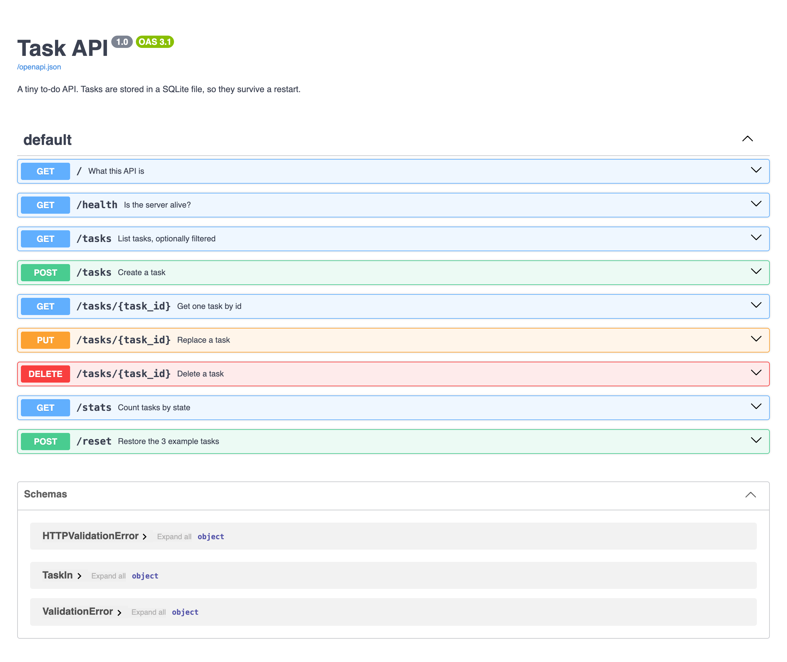

# Task API — FlyRank W2/A1

A small to-do API built with **FastAPI**: create, read, update and delete tasks.
Tasks live **in memory** (a plain Python list) — no database, so restarting the server
wipes everything back to the 3 example tasks. That is deliberate; see
[The mortality experiment](#the-mortality-experiment).

Interactive docs (Swagger UI) come free with FastAPI at **http://localhost:8000/docs**.

## Run it

Needs **Python 3.10+** (check with `python3 --version`). One command, from a clean checkout:

```bash
python3 -m venv .venv && .venv/bin/pip install -r requirements.txt && .venv/bin/uvicorn main:app --reload
```

If your `python3` is older, point the first step at a newer one — e.g. `python3.11 -m venv .venv`
— and the rest of the command is unchanged.

Then open http://localhost:8000/docs and click **Try it out** on any endpoint.

Run the checks: `.venv/bin/python test_api.py` (prints `all checks passed`).

## Endpoints

| Method | Path | Does | Success | Errors |
|---|---|---|---|---|
| GET | `/` | What this API is | 200 | — |
| GET | `/health` | Liveness check → `{"status":"ok"}` | 200 | — |
| GET | `/tasks` | List tasks. Optional `?done=`, `?search=`, `?limit=`, `?offset=` | 200 | 400 bad query |
| GET | `/tasks/{id}` | One task | 200 | 404 unknown id |
| POST | `/tasks` | Create from `{"title": "Buy milk"}` | 201 | 400 missing/empty title |
| PUT | `/tasks/{id}` | Replace `title`, optionally `done` | 200 | 400 invalid body · 404 unknown id |
| DELETE | `/tasks/{id}` | Remove it (empty body) | 204 | 404 unknown id |
| GET | `/stats` | `{"total":3,"done":1,"open":2}` | 200 | — |
| POST | `/reset` | Restore the 3 example tasks | 200 | — |

A task is `{"id": 1, "title": "Read the assignment", "done": true}`.
Every error answers with the same shape: `{"error": "..."}`.

## Proof: the full CRUD cycle via curl

```console
$ curl -i http://localhost:8000/tasks
HTTP/1.1 200 OK
content-type: application/json

[{"id":1,"title":"Read the assignment","done":true},{"id":2,"title":"Build the CRUD API","done":false},{"id":3,"title":"Push it to GitHub","done":false}]

$ curl -i -X POST http://localhost:8000/tasks -H "Content-Type: application/json" -d '{"title":"Buy milk"}'
HTTP/1.1 201 Created
content-type: application/json

{"id":4,"title":"Buy milk","done":false}

$ curl -i -X POST http://localhost:8000/tasks -H "Content-Type: application/json" -d '{}'
HTTP/1.1 400 Bad Request
content-type: application/json

{"error":"title: Field required"}

$ curl -i http://localhost:8000/tasks/4
HTTP/1.1 200 OK
content-type: application/json

{"id":4,"title":"Buy milk","done":false}

$ curl -i -X PUT http://localhost:8000/tasks/4 -H "Content-Type: application/json" -d '{"title":"Buy oat milk","done":true}'
HTTP/1.1 200 OK
content-type: application/json

{"id":4,"title":"Buy oat milk","done":true}

$ curl -i -X DELETE http://localhost:8000/tasks/4
HTTP/1.1 204 No Content

$ curl -i http://localhost:8000/tasks/99
HTTP/1.1 404 Not Found
content-type: application/json

{"error":"Task 99 not found"}
```

(`date` and `server` headers trimmed for readability.)

## Swagger UI

Every endpoint listed, "Try it out" runs the real request:



## Extras

- **Filtering** — `GET /tasks?done=true` returns only finished tasks.
- **Search** — `GET /tasks?search=github` matches on title, case-insensitive.
- **Stats** — `GET /stats` computes counts instead of just storing them.
- **Seed & reset** — `POST /reset` restores the 3 example tasks.
- **Pagination** — `GET /tasks?limit=2&offset=2`, capped at 100. Real APIs never return
  "everything": an unbounded list is a response that gets slower every day it is used,
  until one day it times out for every client at once.

### The mortality experiment

I created a 4th task, restarted the server, and asked for `GET /tasks` again — it was gone,
and the list was back to the 3 seed tasks. The tasks only ever existed in a Python list
inside one running process, so ending the process ended the data.

That is the whole argument for a database: storage has to outlive the program that writes it.

## Notes

- Validation lives in one Pydantic model (`TaskIn`), and error formatting lives in two
  exception handlers — so every route returns `{"error": "..."}` without repeating itself.
- FastAPI's default validation failure is `422`; the handler downgrades it to `400`, which
  is what this assignment specifies.
- Stage 7 ("AI vs me") is not included: the point of that stage is writing the prompt from
  your own memory and judging the output against code you wrote by hand.
